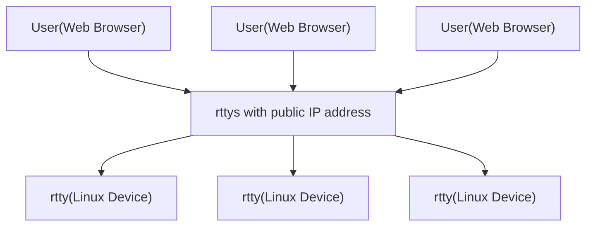

# rtty([中文](/README_ZH.md))

**This project is officially supported by [GL.iNet](https://github.com/gl-inet).**

[1]: https://img.shields.io/badge/license-MIT-brightgreen.svg?style=plastic
[2]: /LICENSE
[3]: https://img.shields.io/badge/PRs-welcome-brightgreen.svg?style=plastic
[4]: https://github.com/zhaojh329/rtty/pulls
[5]: https://img.shields.io/badge/Issues-welcome-brightgreen.svg?style=plastic
[6]: https://github.com/zhaojh329/rtty/issues/new
[10]: https://raw.githubusercontent.com/CodePhiliaX/resource-trusteeship/main/readmex.svg
[11]: https://readmex.com/zhaojh329/rtty
[12]: https://deepwiki.com/badge.svg
[13]: https://deepwiki.com/zhaojh329/rtty

[![license][1]][2]
[![PRs Welcome][3]][4]
[![Issue Welcome][5]][6]
[![ReadmeX][10]][11]
[![Ask DeepWiki][12]][13]

[Xterm.js]: https://github.com/xtermjs/xterm.js
[vue]: https://github.com/vuejs/vue

It is composed of a client and a server. The client is written in pure C. The server is written in go language
and the front-end is written in [Vue].

You can access your device's terminal from anywhere via the web. Distinguish your different device by device ID.

rtty is very suitable for remote maintenance your or your company's thousands of Linux devices deployed around
the world.

## Features
* The client is writen in C language, very small, suitable for embedded Linux
  - No SSL: rtty(32K) + libev(56K)
  - Support SSL: + libmbedtls(88K) + libmbedcrypto(241K) + libmbedx509(48k)
* Execute command remotely in a batch of devices 
* mTLS
* Very convenient to upload and download files
* Access different devices based on device ID
* Support HTTP/HTTPS/WebSocket Proxy - Access your device's Web
* Fully-featured terminal based on [Xterm.js]
* Simple to deployment and easy to use

## Who's using rtty
- [GL.iNet](https://www.gl-inet.com/)
- [Yunlianxin Technology](http://www.iyunlink.com/)
- [One IOT World](https://www.oneiotworld.com/)
- [bitswrt Communication Technology](http://bitswrt.com/)

## Star History

## Star History

## Contributing
If you would like to help making [rtty](/) better,
see the [CONTRIBUTING_ZH.md](/CONTRIBUTING_ZH.md) file.
